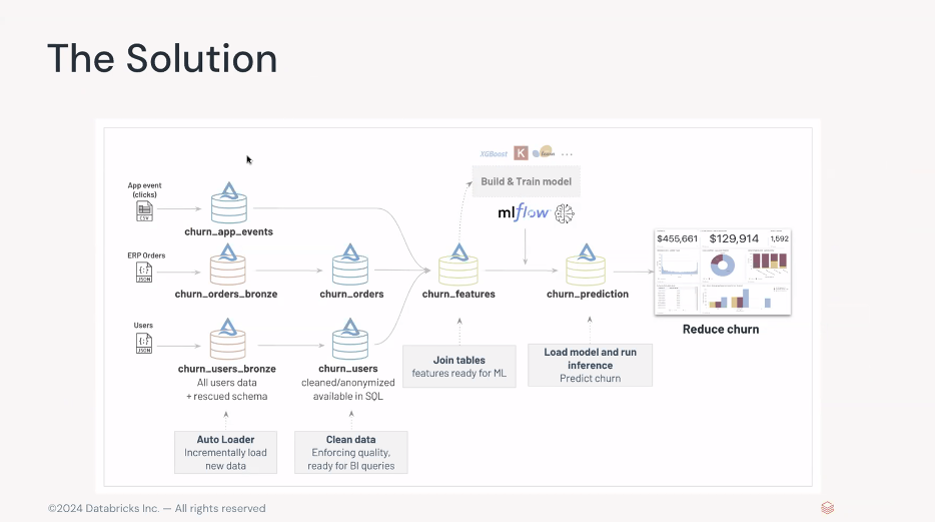
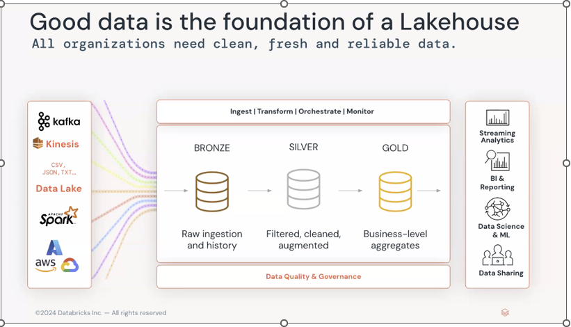
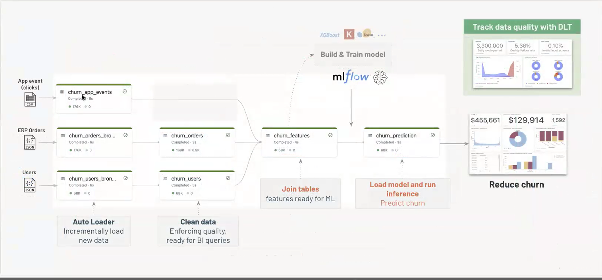
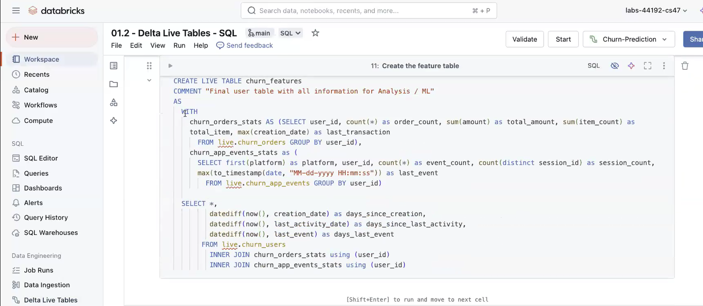
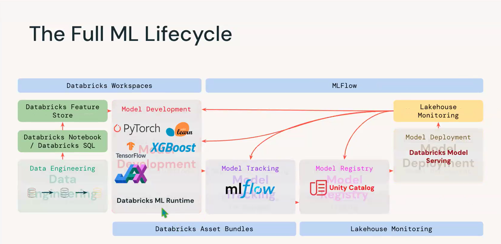

# Data Intelligence with Databricks on GCP Google Cloud

### Build an end-to-end solution with the Lakehouse. Analyse and predict customer churn, we need information coming from different external systems
- Customer profiles coming from our website,
-  order details from our ERP system
-  mobile application clickstream to analyse our customers activity.

### Using this steps
1. Ingest and create our Customer 360 database, with tables easy to query in SQL- We are implementing a *medaillon / multi-hop* architecture, but we could also build a star schema, a data vault or follow any other modeling approach

2. Secure data and grant read access to the Data Analyst and Data Science teams.
3. Run BI queries to analyse existing churn -Ingesting, transforming and cleaning data to create clean SQL tables for our downstream user.

 
 ### Create final churn features Table
 
4. Build ML model to predict which customer is going to churn and why - Implement ML lifecyle
#### The ML lifecycle is made of data pipelines: Data-preprocessing, feature engineering, training, inference, monitoring and retraining

1.  Build a model predicting and explaining customer Churn.
2.  Use scikit-learn algorithm , we will convert the feature table into a pandas model
3.  After running AutoML we saved our best model our MLflow registry
4.  Databricks SQL is used to start analyzing our customer Churn using Power BI tools
